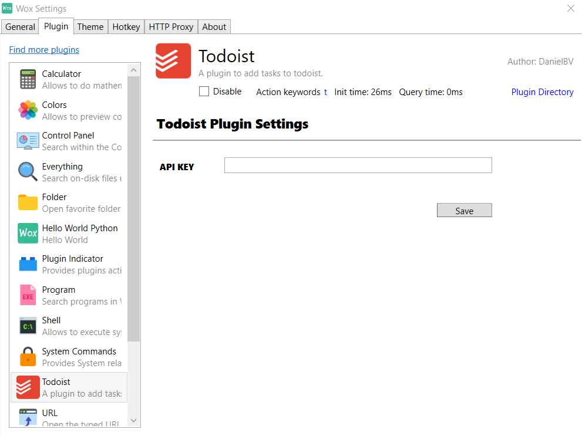
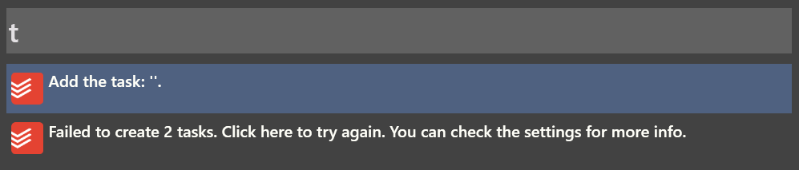
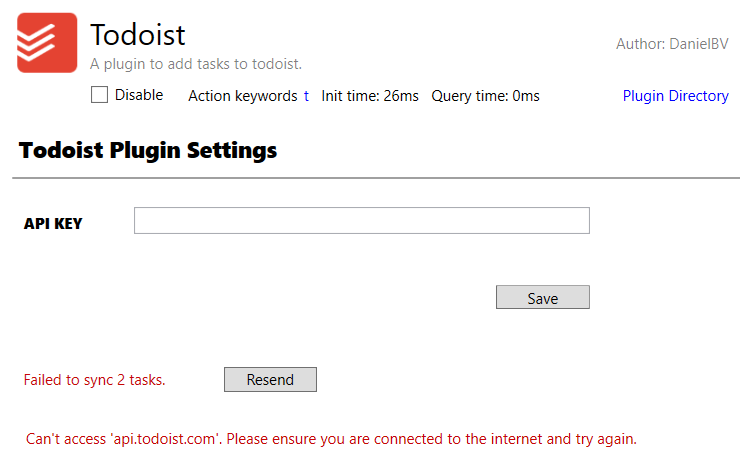

This is a port of the Wox plugin Wox.Plugin.Todoist created by Daniel Bazaco (@DanielBV).

This port is intended to be used for [Flow Launcher](https://github.com/Flow-Launcher/Flow.Launcher). It will not work for Wox.

To download and use this plugin, from [Flow](https://github.com/Flow-Launcher/Flow.Launcher/releases/latest) type `pm install todoist`.

-------------------

# Wox.Plugin.Todoist

Unofficial Wox plugin to use [Todoist's Quick Add](https://get.todoist.help/hc/en-us/articles/115001745265-Task-Quick-Add).

# Installation

```
wpm install Todoist
```

# Usage

1. Set your API key in the plugin settings



2. Add a task using the action keyword 't'.


You can use all the features of [Todoist's Quick Add](https://get.todoist.help/hc/en-us/articles/115001745265-Task-Quick-Add) (natural language, labels, priority...)

## Failed to create task
If a result like this one appears, it means the plugin failed to create a previous task. 



You can try again by clicking the result. Due to the way Wox is implemented, the list of results won't update unless you type something in the launcher. If after typing somethign the result remains, you can go to the plugin's settings to see why it's failing.


